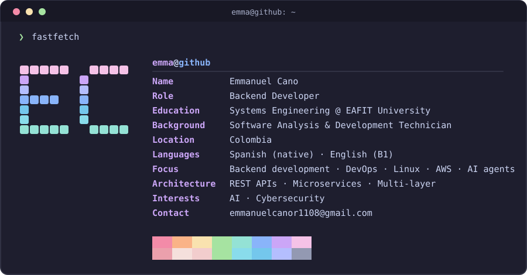

  

 

<!-- ───────────────────────── STACK ───────────────────────── -->

<h3 align="center">STACK</h3>

<picture>
  <source media="(prefers-color-scheme: dark)" srcset="https://skillicons.dev/icons?i=py,fastapi,aws,docker,git,linux,postgres,mongodb,redis,js&theme=dark">
  <source media="(prefers-color-scheme: light)" srcset="https://skillicons.dev/icons?i=py,fastapi,aws,docker,git,linux,postgres,mongodb,redis,js&theme=light">
  
</picture>

  

Currently focused on <b>DevOps</b> · <b>Linux server management</b> · <b>backend development</b> · <b>AWS</b> · <b>AI agent orchestration</b>

 

<!-- ───────────────────────── ACTIVITY ───────────────────────── -->

<h3 align="center">⌘ activity</h3>

  

<picture>
  <source media="(prefers-color-scheme: dark)" srcset="https://ghstats.dev/api/sparkline?username=emma-cano1108&days=30&width=420&line_color=cba6f7&hide_border=true">
  <source media="(prefers-color-scheme: light)" srcset="https://ghstats.dev/api/sparkline?username=emma-cano1108&days=30&width=420&line_color=8839ef&hide_border=true">
  
</picture>

  

<picture>
  <source media="(prefers-color-scheme: dark)" srcset="https://ghstats.dev/api/langs?username=emma-cano1108&layout=compact&max_langs=6&custom_title=Top%20Languages&bg=1e1e2e&text=cdd6f4&title_color=cba6f7&border_color=313244&border_radius=8">
  <source media="(prefers-color-scheme: light)" srcset="https://ghstats.dev/api/langs?username=emma-cano1108&layout=compact&max_langs=6&custom_title=Top%20Languages&bg=eff1f5&text=4c4f69&title_color=8839ef&border_color=ccd0da&border_radius=8">
  
</picture>

 

